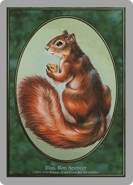
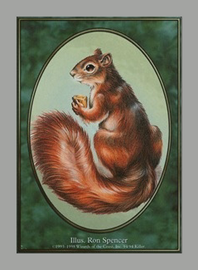

# cardresize

This is a command-line utility to prepare card images to be printed. I don't expect anyone but me to have use for it, so YMMV.

It does the following:

* Normalize the border width by detecting the sides and adding a specified width
* Pad with a specified bleed area, in the same color as the border
* Rotate the image to portrait orientation
* Scale up to a minimum DPI, if necessary
* Convert the images to PNG

## Example

(Ron Spencer's squirrel token from Unglued, aka the best Magic card ever)

** Before: **



** After (scaled to 150 DPI): **



Obviously, with low-resolution images, you're going to get low-quality results. ¯\\\_(ツ)\_/¯

## Usage

```
cardresize [options] <image1> <image2> <etc>
```

Options are in the code - if you're printing standard stuff, the only one you'll really want to fiddle with is `--edge-threshold` - default is `0.1`, which can result in some leftover borders. Crank it up if you want to be a little more aggressive, or down if one of your edges has low contrast.
